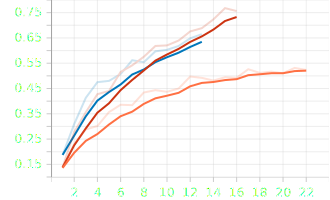
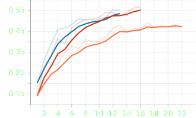
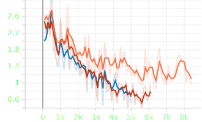
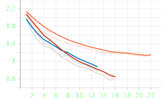
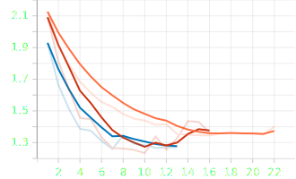

# CNN model for Time of Flight

## Introduction

Yesterday, I was trying to give `Time of Flight` data to a model.
The given data from
[CMI - Detect Behavior with Sensor Data](https://www.kaggle.com/competitions/cmi-detect-behavior-with-sensor-data)
has 5 `Time of Flight` sensors.
I managed to make a tensor of the data like: `[batch_size, sequence_length, 5, 8, 8]`.
So, I told myself that it would be a good Idea to give it to a `CNN`.
But because of the dimension of data, I should give it to the `3d convolutional layer`.

## My model

I came up with a simple model.
You can see the code below:

```python
import torch
from torch import nn

from omegaconf.dictconfig import DictConfig


class TofConv1(nn.Module):
    """My model"""

    def __init__(
            self,
            input_dim: int,
            num_classes: int,
            d_model: int,
            n_heads: int,
            num_layers: int,
            name: str = "model",
    ):
        """
        Model we are using with a transformer.

        Args:
            input_dim: input dimension
            num_classes: number of classes
            d_model: dimension of model
            n_heads: number of attention heads
            num_layers: number of layers
            name: model name
        """
        super().__init__()
        self.input_dim = input_dim
        self.num_classes = num_classes
        self.d_model = d_model
        self.n_heads = n_heads
        self.num_layers = num_layers
        self.name = name

        self.conv_block = nn.Sequential(
            nn.Conv3d(input_dim, self.d_model, kernel_size=3, dilation=1, padding=1),
            nn.ReLU(),
            nn.Dropout(0.3),
            nn.Conv3d(self.d_model, self.d_model, kernel_size=3, dilation=2, padding=2),
            nn.ReLU(),
            nn.Dropout(0.3),
            nn.Conv3d(self.d_model, self.d_model, kernel_size=3, dilation=4, padding=4),
            nn.ReLU(),
            nn.Dropout(0.3),
        )

        self.classifier = nn.Sequential(
            nn.AdaptiveAvgPool2d(1),
            nn.Flatten(),
            nn.Linear(self.d_model, self.d_model * 2),
            nn.ReLU(),
            nn.Dropout(0.3),
            nn.Linear(self.d_model * 2, num_classes),
        )

    @classmethod
    def from_config(cls, cfg: DictConfig) -> "TofConv1":
        """Create an instance of the model from config

        Args:
            cfg (DictConfig): config Object

        Raises:
            ValueError: input_dim is missing
            ValueError: num_classes is missing
            ValueError: d_model is missing
            ValueError: n_head is missing
            ValueError: num_layers is missing

        Returns:
            RModel: Instance of RModel from config
        """
        if "model" not in cfg:
            raise ValueError("cfg.model is required")

        model_cfg = cfg.model

        if "input_dim" not in model_cfg:
            raise ValueError("cfg.input_dim is required")

        if "num_classes" not in model_cfg:
            raise ValueError("cfg.num_classes is required")

        if "d_model" not in model_cfg:
            raise ValueError("cfg.d_model is required")

        if "n_head" not in model_cfg:
            raise ValueError("cfg.n_head is required")

        if "num_layers" not in model_cfg:
            raise ValueError("cfg.num_layers is required")

        if "name" not in cfg:
            name = f"{cls.__name__}"
            print(f"cfg.name wasn't defined, using default name: {name}")
        else:
            name = cfg.name

        return cls(
            model_cfg.input_dim,
            model_cfg.num_classes,
            model_cfg.d_model,
            model_cfg.n_head,
            model_cfg.num_layers,
            name,
        )

    def forward(
            self,
            x: [torch.Tensor, torch.Tensor],
    ) -> torch.Tensor:
        """Processes the data

        Args:
            x (torch.Tensor): data

        Returns:
            torch.Tensor: result of the processing
        """
        x, mask = x  # [batch, seq_len, 5, 8, 8]
        x = x.permute(0, 2, 1, 3, 4)  # [batch, 5, seq_len, 8, 8]
        x = self.conv_block(x)

        x = x.permute(0, 2, 1, 3, 4)  # [batch, seq_len, d_model, 8, 8]

        # Masked average pooling
        if mask is not None:
            mask = mask.unsqueeze(-1)  # [batch, seq_length, 1]
            mask = mask.unsqueeze(-1)  # [batch, seq_length, 1, 1]
            mask = mask.unsqueeze(-1)  # [batch, seq_length, 1, 1, 1]
            x = (x * mask).sum(dim=1) / mask.sum(dim=1)
        else:
            x = x.mean(dim=1)

        logits = self.classifier(x)
        return logits

```

As you can see in the code above, I have a `conv_block` and a `classifier`.
In my `conv_block`, there are 3 `3d convolutional layers` with `relu` activation and `dropout` layers.
All the convolutions have dilation and padding in a way that the output remains the same.

In `forward` function at first, I get the `data` and the `mask` of it.
Now the data looks like: `[batch, sequence_length, 5, 8, 8]`.
But I wanted my channel to be 5.
So, I have permuted `x` to become `[batch, d_model, sequence_length, 8, 8]`
Then, I give the x to my `conv_block`.
After that, I reshape the result to `[batch, sequence_length, d_model, 8, 8]`.
Then, I perform a masked average pooling.
After that, `x` becomes: `[batch, d_model, 8, 8]`.
As you can see, my classifier has a `global average pooling` that changes the shape of x
to `[batch, d_model, 1, 1]`.
Then, I have a `Flatten layer`, so the shape of `x` becomes: `[batch, d_model]`
Now, I am ready to give them to `fully connected layers` to get the `classification` results.

## results

I have tested my model with `d_model = [16, 64, 128]`.
Here are the results (smoothing=60, not-smoothed result is the less transparent one):

* `orange`: 16
* `blue`: 64
* `red`: 128

### f1

#### Train:



#### Validation:



As you can see, the best `validation f1` I got was from `d_model=128`
with about 55%.
The more I made the model deeper, the more the results improved.

### loss

#### Train batch:



#### Train loss:



#### Validation loss:



I put the `early stopping` on `validation loss` with `patience=6`.
So, as you can see, the training has stopped when there was
no improvement on `validation loss` after 6 steps.
I think, it is not a bad idea to put the metric of `early stopping`
to `f1`.
Because, it seems like that the `f1` in `validation` was still improving
by a little bit, but the validation loss was improving.

## Final thoughts

`3d CNN` seems like a good model for `Time of Flight` sensors in this
competition.
I am planning to add new `augmentations` and `normalizations` to see
how much I can improve the results.
Then I want to switch to `transformers` like `swin based transformers`
to see if there is any improvement.