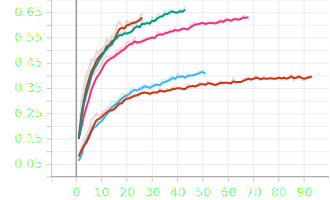
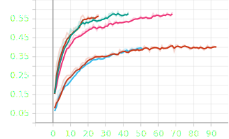

# Try new models for CMI competition in Kaggle

Yesterday and today, I have mostly worked to make my score better on
[CMI - Detect Behavior with Sensor Data](https://www.kaggle.com/competitions/cmi-detect-behavior-with-sensor-data)
competition on Kaggle.
I have tried different models and different approaches.
The best result that I got so far was `0.73`, and I'm trying to improve it,
starting from the basics.

## Acceleration only

In IMU data in this competition has accelerations over `x`, `y`, `z` axes and rotations
in `quaternion` format, which is `w`, `x`, `y`, `z`.
In some sequences, rotations are missing.
So, I thought it might be a good idea to train my model on only accelerations and leave
rotations behind.
I used simple `1D Convolution` layers with dilation, like below:

```python
self.conv_block = nn.Sequential(
    nn.Conv1d(input_dim, self.d_model, kernel_size=3, dilation=1, padding=1),
    nn.ReLU(),
    nn.Dropout(0.3),
    nn.Conv1d(self.d_model, self.d_model, kernel_size=3, dilation=2, padding=2),
    nn.ReLU(),
    nn.Dropout(0.3),
    nn.Conv1d(self.d_model, self.d_model, kernel_size=3, dilation=4, padding=4),
    nn.ReLU(),
    nn.Dropout(0.3),
)
```

* d_model: 16

Surprisingly, I got `0.59` (On `Kaggle` test set), which was pretty good for only accelerations.

## IMU and global features

After I saw that this `1D convolution` method is working, I started to train them on IMU and its global features.
So, for preprocessing, I used these steps:

```python
prs = [
    DropUnnecessaryColumns.from_config(self.cfg),
    DropNulls.from_config(self.cfg),
    ShrinkSequence.from_config(self.cfg),
    SortData.from_config(self.cfg),
    AddMagnitude.from_config(self.cfg),
    AddGlobalFeatures.from_config(self.cfg),
]
```

First, I dropped the columns that I didn't need (thermal and time of flight columns).
Second, I dropped the sequences that their `rotation` is null.
Third, I shrunk the sequences' length to `103`.
Fourth, I sorted them.
Fifth, I added the magnitude of the acceleration with its angles with respect to the axes.
And finally, I added global accelerations and roll, pitch, and yaw.

Now, I have my data ready.
I have trained my model with different `d_model`s:

* 16
* 64
* 128
* 256

The best result that I got was from 128 `d_model`.

## Ensemble two models

I wanted to combine the results of the two models for my `prediction` function required in `Kaggle`.
So, I came up with this idea:

```python
giga_models = []
ensemble_weights = []

# %%

from cmi_sensor_kaggle.models.giga_models.giga_tcn_acc3 import get_giga_model
from cmi_sensor_kaggle.configs.c1_acc3 import get_config

giga_models.append(get_giga_model(
    cfg=get_config(),
    device=DEVICE,
    checkpoint_path=model_path_1,
)
)

ensemble_weights.append(1)

# %% 

from cmi_sensor_kaggle.models.giga_models.giga_d_tcn import get_giga_model
from cmi_sensor_kaggle.configs.d1_tcn_d_model_64 import get_config

giga_models.append(get_giga_model(
    cfg=get_config(),
    device=DEVICE,
    checkpoint_path=model_path_2,
)
)
ensemble_weights.append(2)


# %%


def predict(sequence: pl.DataFrame, demographics: pl.DataFrame) -> str:
    logits = torch.zeros((1, giga_models[0].cfg.num_classes), device=DEVICE)

    for giga_model, weight in zip(giga_models, ensemble_weights):
        if sequence[giga_model.cfg.features_to_check].null_count().pipe(sum).item() == 0:  # type: ignore

            logits = logits + giga_model.predict_sequence(sequence) * weight

    prediction = giga_models[0].logits_to_label(logits)

    return prediction

```

As you can see, by using this method, I can load any model that I want and add it to `giga_models`.
Then, add respective `ensemble_weights` to have different result weights for each model.
In the predict function, first, I check if the features required to load the model exist or not.
If they exist, I run the model and add its result to `logits` with its respective `weight`.
And finally, in `logits_to_label`, I perform an `argmax` and change the `index` back to `category`.

## Results

* `red bottom`: Only Acceleration `d_model=16`
* `cyan`: Global features `d_model=16`
* `pink`: Global features `d_model=64`
* `green`: Global features `d_model=128`
* `red top`: Global features `d_model=256`

### Train f1



### Validation f1



As you can see the best result belongs to `Global features d_model=128`.
Also, the worst result is for `Only acceleration d_model=16`

### Final thoughts

Trying different models and combining them is helping me a lot to
understand the data better.
Today, I have analyzed some top notebooks in `Kaggle`, which got
high scores, and I saw that they were using `bert`.
So, I have implemented a `BERT` model with pre-trained weights.
When I was trying to train it on `Google Colab`, my notebook crashed
because all of my memory was consumed.
This is the next task that I'm going to work on.
I'm going to try to train a `BERT` model on `Google Colab` to see if the
results improve or not.
